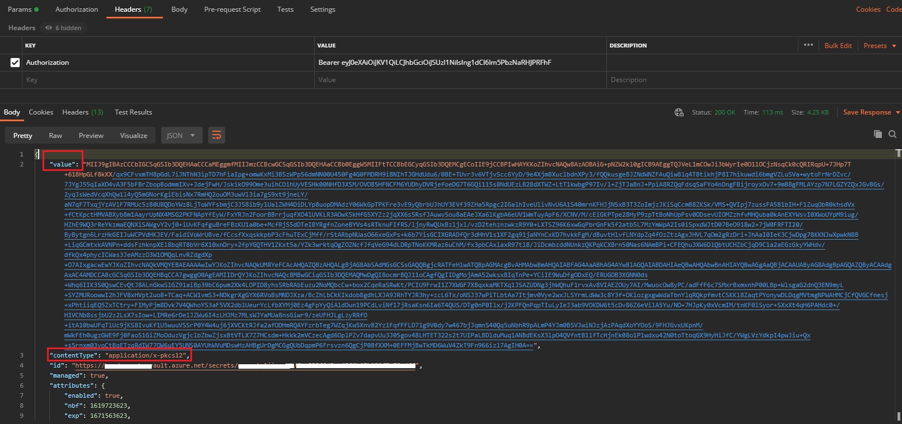

# Azure Key Vault - Certificate store
Key Vault certificates support provides for management of x509 certificates and the following behaviors:
* Allows a certificate owner to create a certificate through a Key Vault creation process or through the import of an existing certificate. Includes both self-signed and Certificate Authority generated certificates.
* Allows a Key Vault certificate owner to implement secure storage and management of X509 certificates without interaction with private key material.
* Allows a certificate owner to create a policy that directs Key Vault to manage the life-cycle of a certificate.
* Allows certificate owners to provide contact information for notification about life-cycle events of expiration and renewal of certificate.
* Supports automatic renewal with selected issuers - Key Vault partner X509 certificate providers / certificate authorities.

## Composition of a Certificate
When a Key Vault certificate is created, an addressable key and secret are also created with the same name. The Key Vault key allows key operations and the Key Vault secret allows retrieval of the certificate value as a secret. A Key Vault certificate also contains public x509 certificate metadata.

The identifier and version of certificates is similar to that of keys and secrets. A specific version of an addressable key and secret created with the Key Vault certificate version is available in the Key Vault certificate response.


## Exportable or Non-exportable key
When a Key Vault certificate is created, it can be retrieved from the addressable secret with the private key in either PFX or PEM format. The policy used to create the certificate must indicate that the key is exportable. If the policy indicates non-exportable, then the private key isn't a part of the value when retrieved as a secret.

The addressable key becomes more relevant with non-exportable KV certificates. The addressable KV key's operations are mapped from keyusage field of the KV certificate policy used to create the KV Certificate

## Create a Self-Signed certificate
```bash
# Create a Self-Signed certificate & asymmetric (public-private) key pair
openssl req -x509 -newkey rsa:2048 -sha256 -keyout abs-private.key -out abs-certificate.crt -subj "/CN=test.com" -days 600
# Export the certficate & private key into a pfx bundled file
openssl pkcs12 -export -name “test.com” -out abs-privatekey-certificate-bundle.pfx -inkey abs-private.key -in abs-certificate.crt
```

## Import the certificate to Azure Key Vault
Before importing the certificate using Azure CLI, ensure that you have a Key Vault in Azure with the proper permissions. 
> The certificate when imported to Key Vault must include the private key. The file must in .pem or .pfx format
```bash
kv=kv-demo-abs # Key Vault name
certName=abs-certificate # name of the certificate which will be uploaded in KV
fileName=abs-privatekey-certificate-bundle.pfx # Bundled certificate containing the private key & certificate
password=***** # .pfx file password

# Import the certificate. If using the default policy, the private key is exportable
az keyvault certificate import --vault-name $kv -n $certName -f $fileName --password $password
```

## Get the id, sid & kid of the imported certificate in Key Vault
### Certificate ID
```bash
# This is the certificate ID which points to the certificate containing public key & metadata
certID=$(az keyvault certificate show -n $certName --vault-name $kv | jq -r ".id")
```
### Secret ID
```bash
# This is the addressable secret ID which points to the pkcs#12 (pfx file) bundle which contains the private key & certificate (public key & metadata). The 
secretID=$(az keyvault certificate show -n $certName --vault-name $kv | jq -r ".sid")
```
The "Value" in the SecretID of the certificate is the base64 encoded value of the .pfx file which bundles the private key & the certificate (containing the public key & metadata) 



### Key ID
```bash
# This is the addressable Key ID which points to the private key
# The key is required for certificates created with non-exportable key (-KeyNotExportable). Non-exportable certificates do not have the private portion contained in secret. Any certificate operation requiring the private part should use the key. For consistency, the key exists for exportable certificates as well.
keyID=$(az keyvault certificate show -n $certName --vault-name $kv | jq -r ".kid")
```
> When creating a new certificate make sure that a Key or Secret does not exist with the same name in the vault. Azure adds in a key and secret with the same name as that of the certificate when creating a new certificate

## Get the Certificate details using REST API
Get the details using Postman or curl
```bash
# Get the OAuth2.0 token
tenantID=$(az account list | jq -r '.[0].tenantId')
client_id=zzzzzz
client_secret=xxxxx
json=$(curl --location --request POST 'https://login.microsoftonline.com/'$tenantID'/oauth2/v2.0/token' \
--header 'Content-Type: application/x-www-form-urlencoded' \
--data-urlencode 'grant_type=client_credentials' \
--data-urlencode 'client_id='$client_id'' \
--data-urlencode 'client_secret='$client_secret'' \
--data-urlencode 'scope=https://vault.azure.net/.default')
jwt=$( jq -r ".access_token" <<<"$json" )
# Get the Certificate details
curl --location --request GET ''$certID'?api-version=2016-10-01' \
--header 'Authorization: Bearer '$jwt''
# Get the Secret details
curl --location --request GET ''$secretID'?api-version=2016-10-01' \
--header 'Authorization: Bearer '$jwt''
# Get the Key details
curl --location --request GET ''$keyID'?api-version=2016-10-01' \
--header 'Authorization: Bearer '$jwt''
```
## For Certificates generated in the Azure key vault
Download the certificate in .pfx format from Azure Portal. Get the private key & certificate details using openssl
```bash
# Get the private key from the downloaded certificate, if exportable
# Enter the password when prompted. If no password, hit enter
openssl pkcs12 -info -in kv-demo-abs-gencert-20210429.pfx -nocerts -nodes
# Get the public key from the downloaded certificate
openssl pkcs12 -info -in kv-demo-abs-gencert-20210429.pfx -nokeys
```

## Reference
* [Azure Key Vault certificates](https://docs.microsoft.com/en-us/azure/key-vault/certificates/about-certificates)
* [Azure Key Vault certificate - Get certificate AND private key](https://github.com/Azure/azure-sdk-for-js/issues/7647)
* [Manage Certificates in Azure Key Vault](https://www.rahulpnath.com/blog/manage-certificates-in-azure-key-vault/)